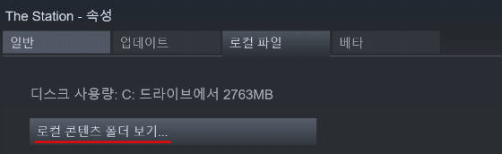

> ### _Explore With Us._

[The Station](http://thestationgame.com/) 한국어화 프로젝트

# 설치 및 패치 적용 방법

1. [패치 파일 다운로드](https://github.com/ryanking13/the-station-kor/releases/download/1.0.0/sharedassets0.assets)

2. 다운로드 한 패치파일을 The Station이 설치된 폴더(The Station_Data)에 덮어씌우기

3. 게임 실행 후 언어 설정을 스페인 어(Español)로 변경

설치된 폴더 위치를 모른다면 스팀에서 The Station 우 클릭 - 로컬 파일 - __로컬 컨텐츠 폴더 보기__ 

# Roadmap

- [x] 게임 내 텍스트(xml) 번역
- [x] 언어 설정 최적화
- [x] 의역 다듬기

# 할 수도 있는 것

- [ ] 게임 내 이미지 번역
- [ ] 폰트 최적화
- [ ] 게임 소개 사이트 번역
